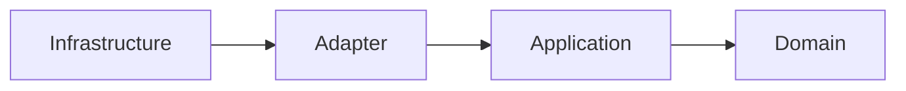
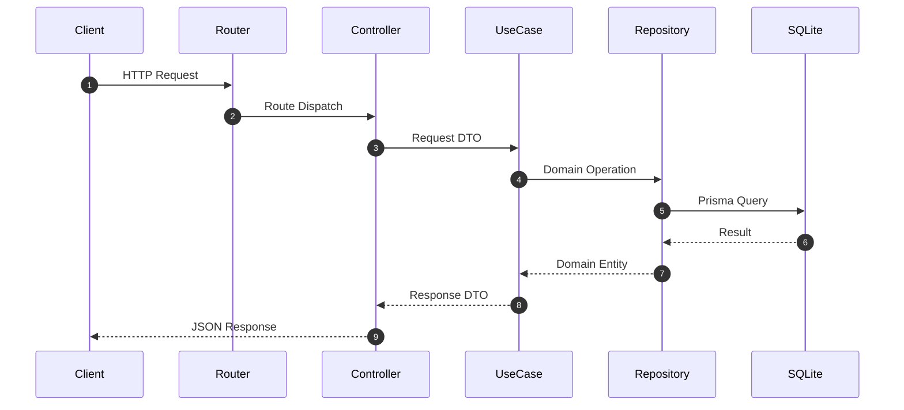

# Library API

軽量かつ拡張可能な蔵書管理APIです。  
Express + TypeScript + Prisma を基盤に、クリーンアーキテクチャで実装しています。

## 概要

- REST API によるユーザー・書籍データ管理
- クリーンアーキテクチャによる責務分離と保守性の確保
- SQLite を使ったシンプルな永続化レイヤ
- Prisma による型安全なデータアクセス

## 主な機能

- ユーザー作成
- 書籍作成
- 書籍ID検索

## アーキテクチャ

### レイヤ構成

| レイヤ | 役割 | ディレクトリ |
|---|---|---|
| Domain | エンティティ、ビジネスルール、抽象インターフェース | `src/domain` |
| Application | ユースケース、DTO | `src/application` |
| Adapter | Controller、Repository実装、外部ライブラリ接続 | `src/adapter` |
| Infrastructure | 依存性注入、Web起動、ルーティング | `src/infrastructure` |

### 依存方向



### リクエストフロー



## ディレクトリ構成

```text
src/
├── domain/
│   ├── entities/
│   ├── repositories/
│   └── utils/
├── application/
│   ├── dtos/
│   └── usecases/
├── adapter/
│   ├── controllers/
│   ├── repositories/
│   └── utils/
└── infrastructure/
    └── web/
        ├── app.ts
        └── routers/
```

## 技術スタック

- Node.js (20+)
- TypeScript (ESM)
- Express
- Prisma
- SQLite
- Vitest
- Biome

## セットアップ

### 1. 依存関係のインストール

```bash
npm install
```

### 2. Prisma Client 生成

```bash
npx prisma generate
```

### 3. スキーマ反映

```bash
npx prisma db push
```

### 4. アプリケーション起動

```bash
npm run dev
```

- デフォルトポート: `3000`
- ベースURL: `http://localhost:3000`

## 環境変数

| 変数名 | 必須 | 説明 | 例 |
|---|---|---|---|
| `DATABASE_URL` | Yes | SQLite接続URL | `file:./dev.db` |
| `PORT` | No | API待受ポート | `3000` |

## API

### `POST /users`

ユーザーを作成します。

Request:

```json
{
  "email": "user@example.com"
}
```

Response: `201 Created`

### `POST /books`

書籍を作成します。

Request:

```json
{
  "title": "Clean Architecture"
}
```

Response: `202 Accepted`

### `GET /books/:id`

書籍をIDで取得します。

Response:

- `200 OK`
- `404 Not Found`

## 開発コマンド

```bash
npm run dev      # 開発サーバー起動
npm test         # テスト実行
npm run lint:fix # コード整形/修正
```

## 関連ドキュメント

- `docs/clean-architecture.md`
- `docs/learning-guide.md`
