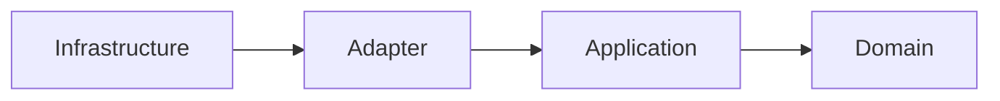
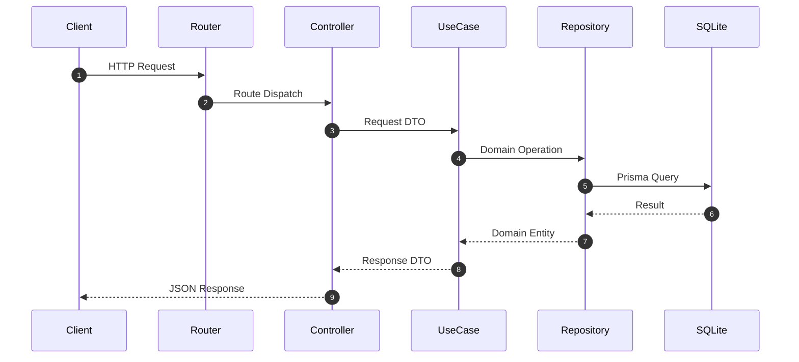
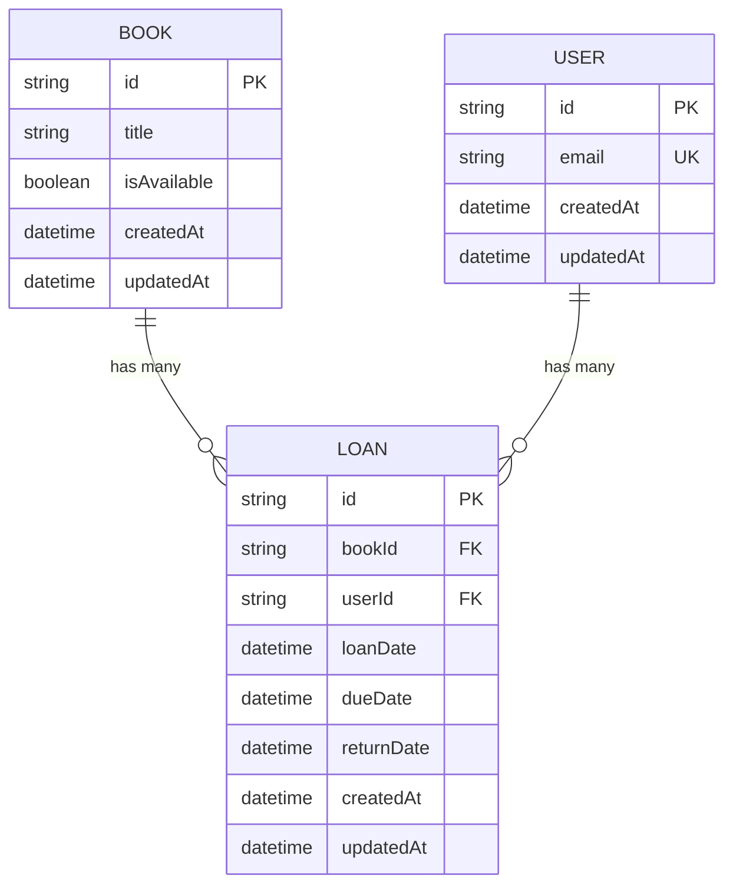

# Library API

Express + TypeScript + Prisma（SQLite）で構成した書籍管理APIです。
クリーンアーキテクチャで実装されており、`src/infrastructure/web/app.ts` で依存性を組み立てています。

## 実装済み機能

- ユーザー作成
- 書籍登録
- 書籍ID検索
- 書籍の貸し出し
- 書籍の返却

### ドメインルール

- 貸出中の書籍は再貸出不可
- 返却済みの貸出履歴は再返却不可
- 返却期限は貸出日から14日後
- ユーザーごとの同時貸出上限は5冊

## アーキテクチャ

| レイヤ         | 役割                                           | ディレクトリ         |
| -------------- | ---------------------------------------------- | -------------------- |
| Domain         | エンティティ、業務ルール、抽象インターフェース | `src/domain`         |
| Application    | ユースケース、DTO、トランザクション抽象        | `src/application`    |
| Adapter        | Controller、Repository実装、ユーティリティ実装 | `src/adapter`        |
| Infrastructure | Express起動、DI、ルーティング                  | `src/infrastructure` |

依存方向は `Infrastructure -> Adapter -> Application -> Domain` です。

### 依存方向



### リクエストフロー



### データモデル



## 技術スタック

- Node.js 20+
- TypeScript（ESM）
- Express 5
- Prisma 7
- SQLite（`@prisma/adapter-better-sqlite3`）
- Vitest
- Biome

## セットアップ

### 1. 依存関係インストール

```bash
npm install
```

### 2. 環境変数設定

`.env` に最低限以下を設定してください。

```env
DATABASE_URL="file:./dev.db"
PORT=3000
```

### 3. Prisma Client 生成

```bash
npx prisma generate
```

### 4. スキーマ反映

```bash
npx prisma db push
```

### 5. 起動

```bash
npm run dev
```

- Base URL: `http://localhost:3000`

## API仕様

### エンドポイント一覧

| Method | Path            | 説明         | 主な成功レスポンス |
| ------ | --------------- | ------------ | ------------------ |
| POST   | `/users`        | ユーザー作成 | `201`              |
| POST   | `/books`        | 書籍作成     | `202`              |
| GET    | `/books/:id`    | 書籍取得     | `200`              |
| POST   | `/loans`        | 書籍貸出     | `201`              |
| POST   | `/loans/return` | 書籍返却     | `200`              |

### リクエスト例

`POST /users`

```json
{
  "email": "user@example.com"
}
```

`POST /books`

```json
{
  "title": "Clean Architecture"
}
```

`POST /loans`

```json
{
  "bookId": "book-uuid",
  "userId": "user-uuid"
}
```

`POST /loans/return`

```json
{
  "id": "loan-uuid"
}
```

### エラーハンドリング（現状）

- `GET /books/:id` の未存在時のみ `404` を返却
- それ以外の業務エラー/例外は `500` を返却
- エラーレスポンス形式: `{ "error": "..." }`

## データモデル

- `Book`: 書籍（`isAvailable` で貸出可否管理）
- `User`: 利用者（`email` はユニーク）
- `Loan`: 貸出履歴（`loanDate`, `dueDate`, `returnDate`）

Prisma スキーマは `prisma/schema.prisma` を参照してください。

## 開発コマンド

```bash
npm run dev      # API起動（tsx）
npm test         # Vitest
npm run lint:fix # Biomeで整形/静的検査
```

## 関連ドキュメント

- `docs/clean-architecture.md`
- `docs/learning-guide.md`
