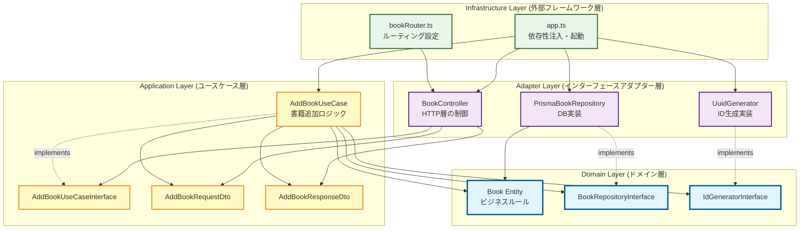
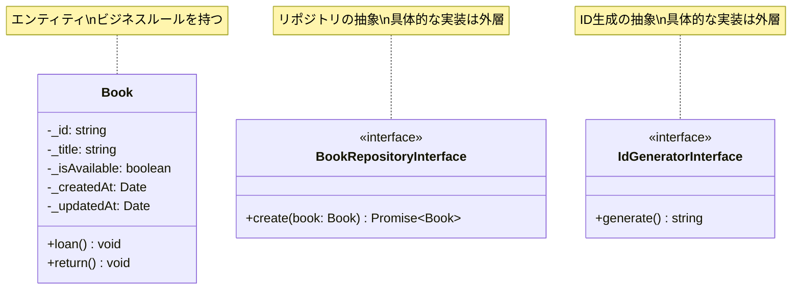
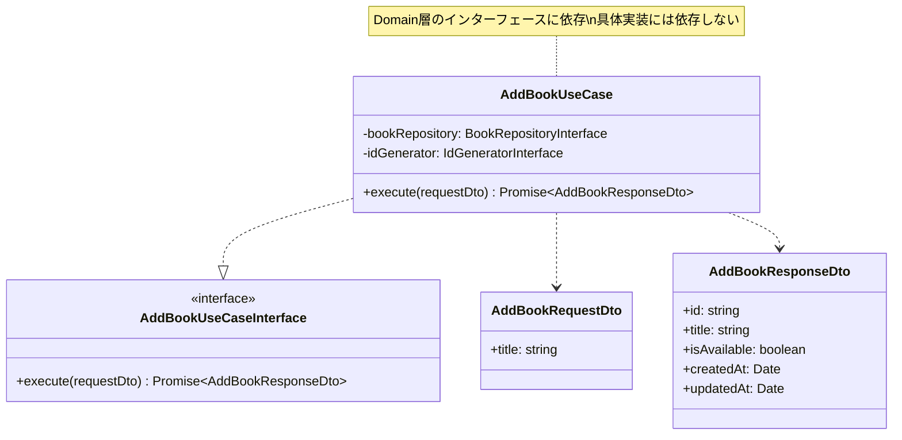
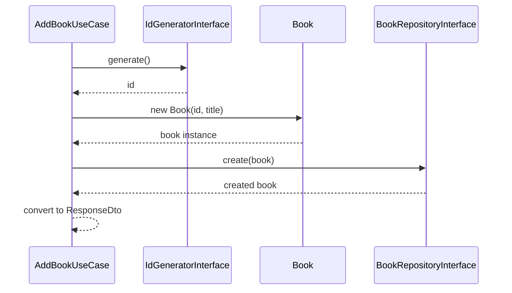
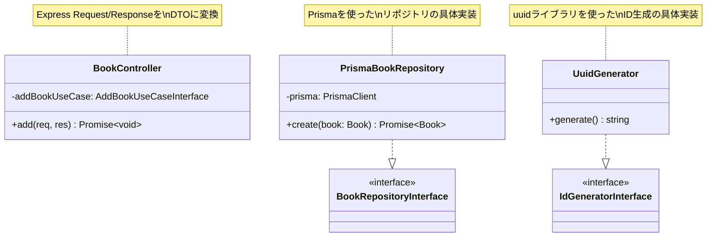
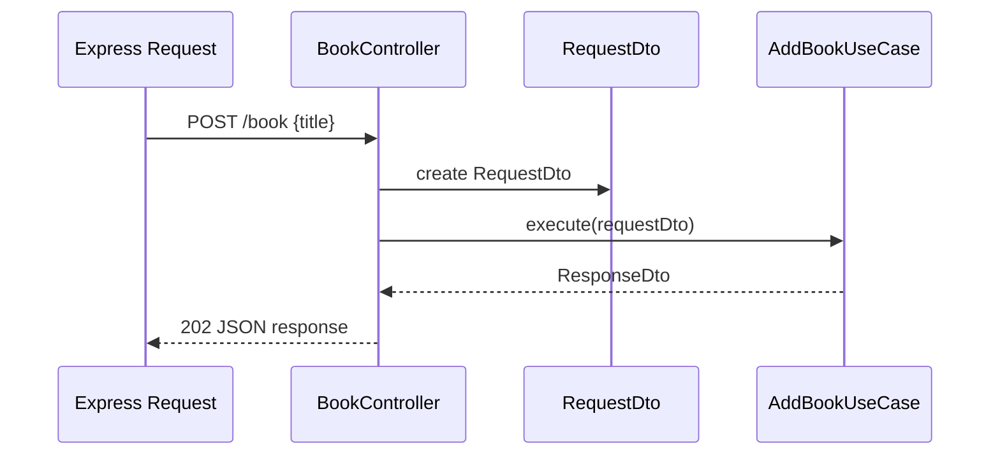
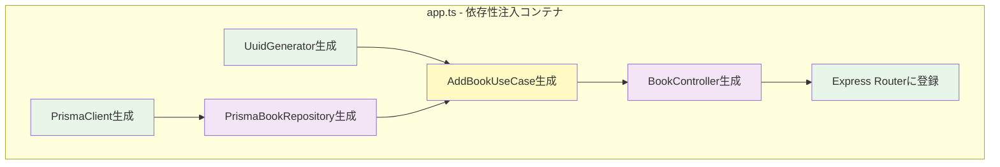
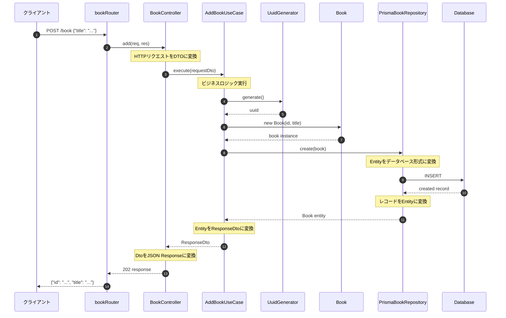
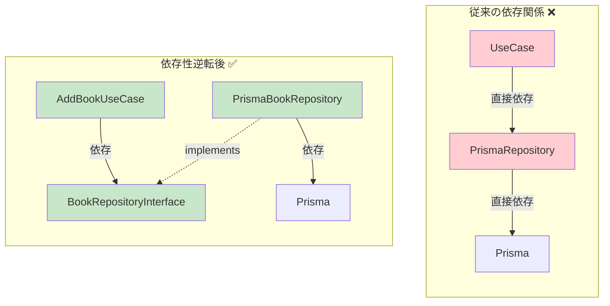
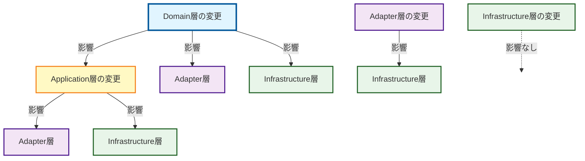

# クリーンアーキテクチャ解説 - 書籍追加機能

## 概要

このドキュメントでは、library-appにおける書籍追加機能のクリーンアーキテクチャ実装について、依存関係と各層の役割を図解で説明します。

## アーキテクチャ全体図



## 依存関係の原則

クリーンアーキテクチャでは、**依存の方向は外側から内側へのみ**という重要な原則があります。


## 各層の責務と依存関係

### 1. Domain層（最内層）

**責務**: ビジネスロジックの核心。フレームワークやライブラリに依存しない純粋なビジネスルール。



**ファイル構成**:
- `src/domain/entities/book.ts`
- `src/domain/repositories/bookRepositoryInterface.ts`
- `src/domain/utils/idGeneratorInterface.ts`

**依存先**: なし（他の層に依存しない）

### 2. Application層（ユースケース層）

**責務**: アプリケーション固有のビジネスルール。ユースケースの実装とデータ変換（DTO）。



**ファイル構成**:
- `src/application/usecases/book/addBookUseCase.ts`
- `src/application/usecases/book/addBookUseCaseInterface.ts`
- `src/application/dtos/book/addBookRequestDto.ts`
- `src/application/dtos/book/addBookResponseDto.ts`

**依存先**: Domain層のみ（Entity, Interface）

**処理フロー**:


### 3. Adapter層（インターフェースアダプター層）

**責務**: 外部とDomain/Application層の間のデータ変換。具体的な実装を提供。



**ファイル構成**:
- `src/adapter/controllers/bookController.ts`
- `src/adapter/repositories/prismaBookRepository.ts`
- `src/adapter/utils/uuidGenerator.ts`

**依存先**: Domain層、Application層

**BookControllerの処理フロー**:


### 4. Infrastructure層（外部フレームワーク層）

**責務**: フレームワーク設定、依存性注入、アプリケーション起動。



**ファイル構成**:
- `src/infrastructure/web/app.ts`
- `src/infrastructure/web/routers/bookRouter.ts`

**依存先**: すべての層（すべてを組み立てる）

**app.tsでの依存性注入**:
```typescript
// 外側から内側へ、順番にインスタンスを生成

// 1. 最も外側の具体実装（Adapter層）
const prisma = new PrismaClient();
const uuidGenerator = new UuidGenerator();

// 2. リポジトリ実装（Adapter層）
const bookRepository = new PrismaBookRepository(prisma);

// 3. ユースケース（Application層）- インターフェースに依存
const addBookUseCase = new AddBookUseCase(bookRepository, uuidGenerator);

// 4. コントローラー（Adapter層）- ユースケースインターフェースに依存
const bookController = new BookController(addBookUseCase);

// 5. ルーターに登録（Infrastructure層）
app.use("/book", bookRoutes(bookController));
```

## リクエストの流れ（全体シーケンス図）



## 依存性逆転の原則（DIP）の実現

クリーンアーキテクチャの核心は**依存性逆転の原則**です。



**メリット**:
1. **テスト容易性**: モックやスタブを使った単体テストが簡単
2. **変更容易性**: Prismaを別のORMに変更しても、ユースケースは影響を受けない
3. **ビジネスロジックの保護**: フレームワークや技術的詳細がビジネスロジックに侵入しない

**具体例**:

`AddBookUseCase`は`BookRepositoryInterface`に依存:
```typescript
export class AddBookUseCase {
  constructor(
    private readonly bookRepository: BookRepositoryInterface,  // インターフェース
    private readonly idGenerator: IdGeneratorInterface,        // インターフェース
  ) {}
}
```

実際の実装は`app.ts`で注入:
```typescript
const bookRepository = new PrismaBookRepository(prisma);  // 具体実装
const uuidGenerator = new UuidGenerator();                 // 具体実装
const addBookUseCase = new AddBookUseCase(bookRepository, uuidGenerator);
```

## 各層の変更の影響範囲



- **Domain層の変更**: すべての層に影響（最も慎重に設計すべき）
- **Application層の変更**: Adapter層とInfrastructure層に影響
- **Adapter層の変更**: Infrastructure層のみに影響
- **Infrastructure層の変更**: 他の層に影響なし（最も変更しやすい）

## まとめ

### クリーンアーキテクチャの利点

1. **フレームワーク非依存**: Expressを別のフレームワークに変更可能
2. **データベース非依存**: Prismaを別のORMやRaw SQLに変更可能
3. **UI非依存**: REST APIをGraphQLに変更可能
4. **テスト可能**: ビジネスルールを外部要素なしでテスト可能
5. **外部依存の遅延決定**: ビジネスロジックを先に設計し、技術選定を後回しにできる

### ディレクトリ構成と層の対応

```
src/
├── domain/              # Domain層（最内層）
│   ├── entities/        # エンティティ
│   ├── repositories/    # リポジトリインターフェース
│   └── utils/           # ドメインユーティリティインターフェース
│
├── application/         # Application層
│   ├── usecases/        # ユースケース実装
│   └── dtos/            # データ転送オブジェクト
│
├── adapter/             # Adapter層
│   ├── controllers/     # HTTPコントローラー
│   ├── repositories/    # リポジトリ実装
│   └── utils/           # ユーティリティ実装
│
└── infrastructure/      # Infrastructure層（最外層）
    └── web/
        ├── app.ts       # 依存性注入・起動
        └── routers/     # ルーティング
```

### 依存関係のチェックポイント

- [ ] Domain層は他の層をimportしていないか？
- [ ] Application層はDomain層のみをimportしているか？
- [ ] Adapter層は具象クラスではなくインターフェースに依存しているか？
- [ ] Infrastructure層で依存性注入が正しく行われているか？
