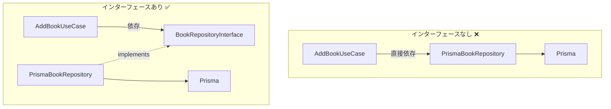
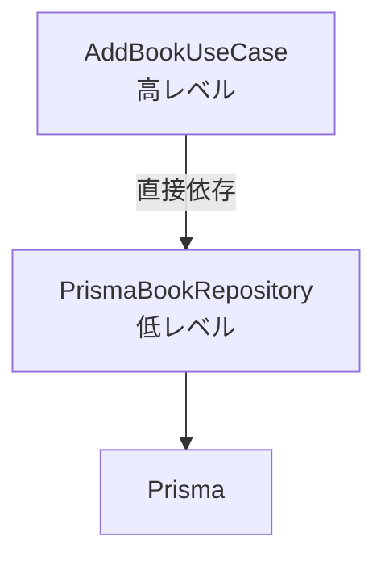
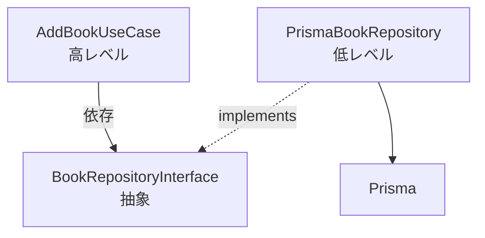

# クリーンアーキテクチャ 学習ガイド

このガイドでは、クリーンアーキテクチャを段階的に理解するための順序と、各ステップで「説明できるべきポイント」を示します。

## 学習の進め方

各ステップで以下を確認してください：

1. **質問を読む**
2. **自分の言葉で説明してみる**（声に出すか、紙に書く）
3. **模範解答と比較する**
4. **コードで確認する**（該当ファイルを見る）

すべての質問に自分の言葉で答えられるようになれば、クリーンアーキテクチャを理解したと言えます。

---

## ステップ1: 最も基本的な原則（所要時間: 10分）

### Q1-1. クリーンアーキテクチャの最も重要な原則は何ですか？

<details>
<summary>模範解答を見る</summary>

**依存の方向は常に外側から内側へ一方向**ということです。

- 内側の層は外側の層のことを知らない
- 外側の層は内側の層に依存できる
- 逆方向の依存は禁止

**具体例**:
- ✅ OK: `AddBookUseCase`が`BookRepositoryInterface`をimportする
- ❌ NG: `Book`エンティティが`AddBookUseCase`をimportする

**コードで確認**:
```typescript
// src/application/usecases/book/addBookUseCase.ts
import { Book } from "../../../domain/entities/book.js";  // ✅ 外→内
import type { BookRepositoryInterface } from "../../../domain/repositories/bookRepositoryInterface.js";  // ✅ 外→内
```

</details>

### Q1-2. なぜ依存の方向を制限するのですか？

<details>
<summary>模範解答を見る</summary>

**ビジネスロジック（内側）を技術的詳細（外側）から保護するため**です。

**メリット**:
1. **変更に強い**: データベースをPrismaからTypeORMに変更しても、ビジネスロジックは影響を受けない
2. **テストしやすい**: データベースなしでビジネスロジックをテストできる
3. **理解しやすい**: ビジネスロジックがフレームワークのコードに埋もれない

**悪い例（従来の3層アーキテクチャ）**:
```typescript
// ❌ ビジネスロジックにPrismaが侵入
class BookService {
  async addBook(title: string) {
    // ビジネスルールとDB操作が混在
    if (title.length > 100) throw new Error("タイトルが長すぎます");
    return await prisma.book.create({ data: { title } });
  }
}
```

**良い例（クリーンアーキテクチャ）**:
```typescript
// ✅ ビジネスロジックは純粋
class AddBookUseCase {
  async execute(requestDto: AddBookRequestDto) {
    const book = new Book(id, requestDto.title);  // ビジネスルール
    return await this.bookRepository.create(book);  // インターフェース経由
  }
}
```

</details>

### Q1-3. 4つの層を内側から順番に言えますか？それぞれ何を扱う層ですか？

<details>
<summary>模範解答を見る</summary>

**内側から外側へ**:

1. **Domain層（ドメイン層）**: ビジネスルールとエンティティ
2. **Application層（ユースケース層）**: アプリケーション固有のビジネスロジック
3. **Adapter層（アダプター層）**: 外部とのデータ変換・具体的な実装
4. **Infrastructure層（基盤層）**: フレームワーク、DB、Web設定

**ディレクトリ対応**:
```
src/
├── domain/          # 1. Domain層
├── application/     # 2. Application層
├── adapter/         # 3. Adapter層
└── infrastructure/  # 4. Infrastructure層
```

**覚え方**: "ド・ア・ア・イ" または "DAI（ダイ）のA2つ版"

</details>

---

## ステップ2: Domain層の理解（所要時間: 15分）

Domain層は**最も重要**で**最も変更されるべきでない**層です。

### Q2-1. Domain層には何を置きますか？3つ挙げてください。

<details>
<summary>模範解答を見る</summary>

1. **エンティティ（Entity）**: ビジネスルールを持つオブジェクト
2. **リポジトリインターフェース**: データ永続化の抽象
3. **ドメインサービスのインターフェース**: ビジネスロジックで必要な機能の抽象

**このプロジェクトの例**:
```
src/domain/
├── entities/
│   └── book.ts                          # 1. エンティティ
├── repositories/
│   └── bookRepositoryInterface.ts       # 2. リポジトリインターフェース
└── utils/
    └── idGeneratorInterface.ts          # 3. サービスインターフェース
```

**重要**: Domain層には**インターフェースのみ**を置き、**具体的な実装は置かない**

</details>

### Q2-2. `Book`エンティティは何をする役割ですか？

<details>
<summary>模範解答を見る</summary>

**書籍に関するビジネスルールをカプセル化する**役割です。

**具体的には**:
- データを保持する（id, title, isAvailable など）
- ビジネスルールを実行する（loan: 貸出、return: 返却）
- 不正な状態にならないよう保護する

**コードで確認**:
```typescript
// src/domain/entities/book.ts
export class Book {
  loan() {
    if (!this.isAvailable) {
      throw new Error("この本は既に貸し出しされています。");  // ビジネスルール
    }
    this._isAvailable = false;
  }
}
```

**重要ポイント**:
- Bookエンティティは**Prismaを知らない**
- Bookエンティティは**Expressを知らない**
- 純粋なビジネスロジックのみ

</details>

### Q2-3. なぜリポジトリを「インターフェース」として定義するのですか？

<details>
<summary>模範解答を見る</summary>

**ビジネスロジックがデータベースの具体的な実装に依存しないため**です。

**依存性逆転の原則（DIP）の実現**:



**メリット**:
1. **変更容易性**: PrismaをTypeORMに変更してもユースケースは変更不要
2. **テスト容易性**: モックリポジトリで簡単にテスト可能
3. **複数実装**: InMemoryRepository（テスト用）とPrismaRepository（本番用）を切り替えられる

**コードで確認**:
```typescript
// Domain層: インターフェース定義
// src/domain/repositories/bookRepositoryInterface.ts
export interface BookRepositoryInterface {
  create(book: Book): Promise<Book>;
}

// Adapter層: 具体実装
// src/adapter/repositories/prismaBookRepository.ts
export class PrismaBookRepository implements BookRepositoryInterface {
  async create(book: Book): Promise<Book> {
    // Prismaを使った具体実装
  }
}
```

</details>

---

## ステップ3: Application層の理解（所要時間: 20分）

Application層は**アプリケーション固有のビジネスロジック**を扱います。

### Q3-1. ユースケース（UseCase）とは何ですか？

<details>
<summary>模範解答を見る</summary>

**「ユーザーがシステムを使って何かを達成する」という1つのシナリオを実装したもの**です。

**このプロジェクトの例**:
- `AddBookUseCase`: ユーザーが書籍を追加する

**ユースケースの責務**:
1. **ビジネスロジックの調整**: エンティティとリポジトリを使って処理を実行
2. **データ変換**: DTOを使って入出力データを整形
3. **トランザクション制御**: 複数の処理をまとめる

**コードで確認**:
```typescript
// src/application/usecases/book/addBookUseCase.ts
export class AddBookUseCase {
  async execute(requestDto: AddBookRequestDto): Promise<AddBookResponseDto> {
    // 1. IDを生成
    const id = this.idGenerator.generate();

    // 2. エンティティを作成（ビジネスルール適用）
    const newBook = new Book(id, requestDto.title);

    // 3. リポジトリで永続化
    const createdBook = await this.bookRepository.create(newBook);

    // 4. レスポンスDTOに変換
    return {
      id: createdBook.id,
      title: createdBook.title,
      isAvailable: createdBook.isAvailable,
      createdAt: createdBook.createdAt,
      updatedAt: createdBook.updatedAt,
    };
  }
}
```

**1ユースケース = 1クラス = 1つのビジネスシナリオ**

</details>

### Q3-2. DTOとは何ですか？なぜ必要ですか？

<details>
<summary>模範解答を見る</summary>

**DTO（Data Transfer Object）= データ転送オブジェクト**

層をまたいでデータをやり取りするための、**単純なデータ構造**です。

**なぜ必要か**:
1. **層の境界を明確にする**: どのデータが入力/出力されるか明示
2. **エンティティを保護する**: エンティティの内部構造を外部に公開しない
3. **変更の影響を局所化**: DTOの変更はその層だけに影響

**コードで確認**:
```typescript
// 入力DTO（Controller → UseCase）
// src/application/dtos/book/addBookRequestDto.ts
export interface AddBookRequestDto {
  title: string;  // 必要最小限のデータのみ
}

// 出力DTO（UseCase → Controller）
// src/application/dtos/book/addBookResponseDto.ts
export interface AddBookResponseDto {
  id: string;
  title: string;
  isAvailable: boolean;
  createdAt: Date;
  updatedAt: Date;
}
```

**エンティティとDTOの違い**:
| | エンティティ | DTO |
|---|---|---|
| 役割 | ビジネスロジック | データ転送 |
| メソッド | あり（loan, returnなど） | なし（データのみ） |
| 場所 | Domain層 | Application層 |
| 例 | `Book` | `AddBookResponseDto` |

</details>

### Q3-3. なぜユースケースは「インターフェース」に依存するのですか？

<details>
<summary>模範解答を見る</summary>

**テスト容易性と変更容易性のため**です。

**コードで確認**:
```typescript
// src/application/usecases/book/addBookUseCase.ts
export class AddBookUseCase {
  constructor(
    private readonly bookRepository: BookRepositoryInterface,  // ✅ インターフェース
    private readonly idGenerator: IdGeneratorInterface,        // ✅ インターフェース
  ) {}
}
```

**もし具体クラスに依存していたら ❌**:
```typescript
// ❌ 悪い例
export class AddBookUseCase {
  constructor(
    private readonly bookRepository: PrismaBookRepository,  // 具体クラス
    private readonly idGenerator: UuidGenerator,            // 具体クラス
  ) {}
}
```

**問題点**:
1. Prismaを変更したらユースケースも変更が必要
2. テスト時にモックDBが必須（遅い・複雑）
3. Prismaなしでユースケースのテストができない

**インターフェースに依存するメリット**:
```typescript
// テスト時
const mockRepository = {
  create: jest.fn().mockResolvedValue(mockBook)
};
const useCase = new AddBookUseCase(mockRepository, mockIdGenerator);
// → Prisma不要でテスト可能！
```

</details>

---

## ステップ4: Adapter層の理解（所要時間: 20分）

Adapter層は**外部世界とDomain/Application層の橋渡し**をします。

### Q4-1. Adapter層は何をする層ですか？

<details>
<summary>模範解答を見る</summary>

**外部（HTTP、DB、外部API等）とアプリケーション内部のデータ形式を変換する層**です。

**3つの主要コンポーネント**:

1. **Controller**: HTTPリクエスト/レスポンス ↔ DTO
2. **Repository実装**: エンティティ ↔ データベース形式
3. **外部サービス実装**: インターフェース ↔ 具体的なライブラリ

**このプロジェクトの例**:
```
src/adapter/
├── controllers/
│   └── bookController.ts        # Express → DTO変換
├── repositories/
│   └── prismaBookRepository.ts  # Entity → Prisma変換
└── utils/
    └── uuidGenerator.ts         # Interface → uuid実装
```

</details>

### Q4-2. `BookController`は何をしていますか？

<details>
<summary>模範解答を見る</summary>

**ExpressのHTTPリクエスト/レスポンスとDTOの間の変換**をしています。

**処理の流れ**:
```
HTTPリクエスト → Controller → DTO → UseCase → DTO → Controller → HTTPレスポンス
```

**コードで確認**:
```typescript
// src/adapter/controllers/bookController.ts
export class BookController {
  constructor(private readonly addBookUseCase: AddBookUseCaseInterface) {}

  async add(req: Request, res: Response): Promise<void> {
    try {
      // 1. HTTPリクエスト → RequestDTO に変換
      const requestDto: AddBookRequestDto = {
        title: req.body.title,
      };

      // 2. ユースケースを実行
      const book = await this.addBookUseCase.execute(requestDto);

      // 3. ResponseDTO → HTTPレスポンス に変換
      res.status(202).json(book);
    } catch (error) {
      // 4. エラーハンドリング
      res.status(500).json({ error: "書籍の登録に失敗しました" });
    }
  }
}
```

**重要ポイント**:
- Controllerは`AddBookUseCaseInterface`に依存（具体クラスではない）
- Expressに依存しているのはこの層だけ
- ビジネスロジックは含まない（変換とエラーハンドリングのみ）

</details>

### Q4-3. `PrismaBookRepository`は何をしていますか？

<details>
<summary>模範解答を見る</summary>

**BookエンティティとPrismaのデータベース形式の間の変換**をしています。

**処理の流れ**:
```
Entity → Repository → Prismaデータ → DB
DB → Prismaデータ → Repository → Entity
```

**コードで確認**:
```typescript
// src/adapter/repositories/prismaBookRepository.ts
export class PrismaBookRepository implements BookRepositoryInterface {
  async create(book: Book): Promise<Book> {
    // 1. Entity → Prismaデータ に変換
    const createdBook = await this.prisma.book.create({
      data: {
        id: book.id,
        title: book.title,
        isAvailable: book.isAvailable,
        createdAt: book.createdAt,
        updatedAt: book.updatedAt,
      },
    });

    // 2. Prismaデータ → Entity に変換
    return new Book(
      createdBook.id,
      createdBook.title,
      createdBook.isAvailable,
      createdBook.createdAt,
      createdBook.updatedAt,
    );
  }
}
```

**重要ポイント**:
- `BookRepositoryInterface`を実装
- 常にBookエンティティを返す（Prismaの型ではない）
- Prismaに依存しているのはこの層だけ

**変更例**:
もしTypeORMに変更したい場合、`TypeOrmBookRepository`を新しく作るだけで、他の層は変更不要！

</details>

---

## ステップ5: Infrastructure層の理解（所要時間: 15分）

Infrastructure層は**すべてを組み立てて起動する**層です。

### Q5-1. Infrastructure層は何をする層ですか？

<details>
<summary>模範解答を見る</summary>

**依存性注入（DI）とアプリケーションの起動**を担当する層です。

**主な責務**:
1. **依存性注入**: すべてのクラスのインスタンスを生成し、注入する
2. **フレームワーク設定**: Express、ルーティングなどの設定
3. **アプリケーション起動**: サーバーの起動

**このプロジェクトの例**:
```
src/infrastructure/
└── web/
    ├── app.ts          # 依存性注入・起動
    └── routers/
        └── bookRouter.ts  # ルーティング設定
```

</details>

### Q5-2. `app.ts`で行われている「依存性注入」とは何ですか？順番も含めて説明してください。

<details>
<summary>模範解答を見る</summary>

**依存性注入（DI: Dependency Injection）**とは、**クラスが必要とする依存オブジェクトを外部から渡すこと**です。

**app.tsでの生成順序**（外側から内側へ）:

```typescript
// 1. 最も外側の具体実装を生成
const prisma = new PrismaClient();              // DB接続
const uuidGenerator = new UuidGenerator();       // ID生成

// 2. リポジトリを生成（依存を注入）
const bookRepository = new PrismaBookRepository(prisma);

// 3. ユースケースを生成（依存を注入）
const addBookUseCase = new AddBookUseCase(
  bookRepository,    // インターフェースとして注入
  uuidGenerator      // インターフェースとして注入
);

// 4. コントローラーを生成（依存を注入）
const bookController = new BookController(addBookUseCase);

// 5. ルーターに登録
app.use("/book", bookRoutes(bookController));
```

**なぜこの順番か**:
- 依存される側（内側）から先に作る必要がある
- 依存する側（外側）は依存される側を受け取る

**依存性注入のメリット**:
1. **テスト容易性**: テスト時にモックを注入できる
2. **柔軟性**: 本番用とテスト用で異なる実装を注入できる
3. **疎結合**: クラスが具体的な実装を知らない

</details>

### Q5-3. なぜすべての依存性注入を1箇所（app.ts）で行うのですか？

<details>
<summary>模範解答を見る</summary>

**アプリケーション全体の依存関係を一箇所で管理するため**です。

**メリット**:

1. **見通しが良い**: どのクラスが何に依存しているか一目瞭然
2. **変更が容易**: 実装を変更する際、app.tsだけ修正すればOK
3. **設定の統一**: 本番環境、テスト環境の切り替えが簡単

**例: 本番とテストで実装を切り替え**:
```typescript
// 本番環境（app.ts）
const bookRepository = new PrismaBookRepository(prisma);

// テスト環境（app.test.ts）
const bookRepository = new InMemoryBookRepository();  // メモリ上のDB
```

**例: ログ機能の追加**:
```typescript
// ログ付きリポジトリに変更（app.tsのみ変更）
const baseRepository = new PrismaBookRepository(prisma);
const bookRepository = new LoggingRepositoryDecorator(baseRepository);
// → 他のファイルは変更不要！
```

**重要**: この層だけが他のすべての層を知っている（依存している）唯一の場所

</details>

---

## ステップ6: データの流れ全体（所要時間: 20分）

ここまでの理解を統合して、データの流れを追います。

### Q6-1. `POST /book` リクエストがどのように処理されるか、各層を経由して順番に説明してください。

<details>
<summary>模範解答を見る</summary>

**1. Infrastructure層: リクエスト受付**
```typescript
// bookRouter.ts
router.post("/", bookController.add.bind(bookController));
// HTTPリクエストを受け取る
```

**2. Adapter層: Controller - HTTPからDTOへ変換**
```typescript
// bookController.ts
const requestDto: AddBookRequestDto = {
  title: req.body.title,  // HTTP body → DTO
};
const book = await this.addBookUseCase.execute(requestDto);
```

**3. Application層: UseCase - ビジネスロジック実行**
```typescript
// addBookUseCase.ts
const id = this.idGenerator.generate();          // ID生成
const newBook = new Book(id, requestDto.title);  // Entity作成
const createdBook = await this.bookRepository.create(newBook);  // 永続化
```

**4. Domain層: Entity - ビジネスルール適用**
```typescript
// book.ts
new Book(id, title, isAvailable=true, ...)  // 初期状態でインスタンス化
```

**5. Adapter層: Repository - EntityからDB形式へ変換**
```typescript
// prismaBookRepository.ts
const createdBook = await this.prisma.book.create({
  data: {
    id: book.id,
    title: book.title,
    isAvailable: book.isAvailable,
    ...
  },
});
return new Book(...);  // DB結果をEntityに変換して返す
```

**6. Application層: UseCase - EntityをResponseDTOへ変換**
```typescript
// addBookUseCase.ts
return {
  id: createdBook.id,
  title: createdBook.title,
  isAvailable: createdBook.isAvailable,
  ...
};
```

**7. Adapter層: Controller - DTOからHTTPレスポンスへ変換**
```typescript
// bookController.ts
res.status(202).json(book);  // DTO → JSON response
```

**8. Infrastructure層: レスポンス送信**

**データの形式変化**:
```
HTTP Request body
  ↓ (Controller)
AddBookRequestDto
  ↓ (UseCase)
Book Entity
  ↓ (Repository)
Prisma data → Database
  ↓ (Repository)
Book Entity
  ↓ (UseCase)
AddBookResponseDto
  ↓ (Controller)
HTTP Response JSON
```

</details>

### Q6-2. もしPrismaをTypeORMに変更したい場合、どのファイルを修正すれば良いですか？

<details>
<summary>模範解答を見る</summary>

**修正が必要なファイル（2つだけ）**:

1. **Adapter層: Repository実装を新規作成**
```typescript
// src/adapter/repositories/typeOrmBookRepository.ts（新規作成）
export class TypeOrmBookRepository implements BookRepositoryInterface {
  async create(book: Book): Promise<Book> {
    // TypeORMを使った実装
  }
}
```

2. **Infrastructure層: 依存性注入を変更**
```typescript
// src/infrastructure/web/app.ts
// 変更前
const bookRepository = new PrismaBookRepository(prisma);

// 変更後
const bookRepository = new TypeOrmBookRepository(connection);
```

**修正が不要なファイル（変更の影響を受けない）**:
- ✅ `book.ts`（Entity） - Domainレイヤー
- ✅ `bookRepositoryInterface.ts` - Domainレイヤー
- ✅ `addBookUseCase.ts` - Applicationレイヤー
- ✅ `addBookUseCaseInterface.ts` - Applicationレイヤー
- ✅ `bookController.ts` - Adapterレイヤー
- ✅ DTOファイル - Applicationレイヤー

**理由**: これらのファイルは`BookRepositoryInterface`に依存しており、具体的な実装（Prisma/TypeORM）を知らないから。

**これがクリーンアーキテクチャの最大のメリット！**

</details>

### Q6-3. もしExpressをFastifyに変更したい場合、どのファイルを修正すれば良いですか？

<details>
<summary>模範解答を見る</summary>

**修正が必要なファイル（3つ）**:

1. **Adapter層: Controller実装を新規作成**
```typescript
// src/adapter/controllers/fastifyBookController.ts（新規作成）
import type { FastifyRequest, FastifyReply } from 'fastify';

export class FastifyBookController {
  async add(req: FastifyRequest, res: FastifyReply): Promise<void> {
    const requestDto: AddBookRequestDto = {
      title: req.body.title,
    };
    const book = await this.addBookUseCase.execute(requestDto);
    res.status(202).send(book);  // Expressの.json()ではなく.send()
  }
}
```

2. **Infrastructure層: ルーター実装を新規作成**
```typescript
// src/infrastructure/web/routers/fastifyBookRouter.ts（新規作成）
export function bookRoutes(bookController: FastifyBookController) {
  return async (fastify) => {
    fastify.post("/", bookController.add.bind(bookController));
  };
}
```

3. **Infrastructure層: app.tsを書き換え**
```typescript
// src/infrastructure/web/app.ts
import fastify from 'fastify';

const app = fastify();
// ... 依存性注入は同じ ...
const bookController = new FastifyBookController(addBookUseCase);
app.register(bookRoutes(bookController), { prefix: '/book' });
```

**修正が不要なファイル**:
- ✅ `addBookUseCase.ts` - Applicationレイヤー
- ✅ `prismaBookRepository.ts` - Adapterレイヤー
- ✅ すべてのDomain層
- ✅ すべてのDTO

**理由**: ビジネスロジックはHTTPフレームワークに依存していないから。

</details>

---

## ステップ7: 依存性逆転の原則（DIP）の深い理解（所要時間: 15分）

これがクリーンアーキテクチャの核心です。

### Q7-1. 「依存性逆転の原則（DIP）」とは何ですか？具体例で説明してください。

<details>
<summary>模範解答を見る</summary>

**高レベルモジュール（ビジネスロジック）が低レベルモジュール（技術的詳細）に依存するのではなく、両方が抽象（インターフェース）に依存すべき**という原則です。

**従来の依存関係（悪い例）❌**:


```typescript
// ❌ 悪い例: UseCaseがPrismaに依存
class AddBookUseCase {
  constructor(private repository: PrismaBookRepository) {}
  // → Prismaを変更したらUseCaseも変更が必要
}
```

**依存性逆転後（良い例）✅**:


```typescript
// ✅ 良い例: UseCaseがインターフェースに依存
class AddBookUseCase {
  constructor(private repository: BookRepositoryInterface) {}
  // → Prismaを変更してもUseCaseは変更不要
}

class PrismaBookRepository implements BookRepositoryInterface {
  // インターフェースを実装
}
```

**なぜ「逆転」なのか**:
従来は「高レベル → 低レベル」という依存の方向だったのが、インターフェースを導入することで「高レベル ← インターフェース ← 低レベル」となり、依存の方向が逆転するから。

**実際の効果**:
```typescript
// テスト時
const mockRepo = { create: jest.fn() };
const useCase = new AddBookUseCase(mockRepo);  // モック注入可能

// 本番時
const realRepo = new PrismaBookRepository(prisma);
const useCase = new AddBookUseCase(realRepo);  // 実装注入可能
```

</details>

### Q7-2. インターフェースはどの層に置くべきですか？なぜですか？

<details>
<summary>模範解答を見る</summary>

**使う側の層（内側の層）に置くべき**です。

**このプロジェクトの例**:

```
src/
├── domain/
│   └── repositories/
│       └── bookRepositoryInterface.ts    # ✅ Domain層に配置
│
└── adapter/
    └── repositories/
        └── prismaBookRepository.ts       # Adapterで実装
```

**理由**:

1. **依存の方向を保つため**
   - UseCaseがインターフェースを使う
   - インターフェースはUseCaseと同じ層（またはより内側）にあるべき
   - RepositoryがUseCaseに依存してはいけない

2. **変更の影響を最小化するため**
   - インターフェースはビジネスロジックの要求を表現
   - 具体実装が変わってもインターフェースは変わらない

**間違った配置 ❌**:
```
src/
├── domain/
│   └── ...
│
└── adapter/
    └── repositories/
        ├── bookRepositoryInterface.ts    # ❌ Adapter層に配置
        └── prismaBookRepository.ts
```

この場合、Domain層がAdapter層に依存してしまう（依存の方向が逆）。

**正しい考え方**:
- インターフェース = 「内側の層が外側の層に要求する契約」
- したがってインターフェースは内側の層に属する

</details>

### Q7-3. インターフェースを使わない場合、どんな問題が起きますか？3つ挙げてください。

<details>
<summary>模範解答を見る</summary>

**1. テストが困難になる**

```typescript
// インターフェースなし ❌
class AddBookUseCase {
  constructor(private repository: PrismaBookRepository) {}
}

// テスト時、本物のDBが必要
test('書籍を追加できる', async () => {
  const prisma = new PrismaClient();  // 本物のDB接続が必要
  const repository = new PrismaBookRepository(prisma);
  const useCase = new AddBookUseCase(repository);
  // → 遅い、セットアップが複雑
});
```

```typescript
// インターフェースあり ✅
class AddBookUseCase {
  constructor(private repository: BookRepositoryInterface) {}
}

// テスト時、モックでOK
test('書籍を追加できる', async () => {
  const mockRepository = { create: jest.fn().mockResolvedValue(mockBook) };
  const useCase = new AddBookUseCase(mockRepository);
  // → 速い、シンプル
});
```

**2. 技術スタックの変更が困難になる**

```typescript
// インターフェースなし ❌
class AddBookUseCase {
  constructor(private repository: PrismaBookRepository) {}  // Prismaに固定
  // TypeORMに変更するには、UseCaseも変更が必要
}
```

```typescript
// インターフェースあり ✅
class AddBookUseCase {
  constructor(private repository: BookRepositoryInterface) {}
  // PrismaでもTypeORMでも、インターフェースを実装すればOK
}
```

**3. ビジネスロジックが技術的詳細に汚染される**

```typescript
// インターフェースなし ❌
class AddBookUseCase {
  constructor(private repository: PrismaBookRepository) {}

  async execute(requestDto: AddBookRequestDto) {
    // Prismaの型やエラーハンドリングが必要に
    try {
      const book = await this.repository.prisma.book.create(...);
    } catch (PrismaClientKnownRequestError e) {
      // Prismaのエラーハンドリング
    }
  }
}
```

```typescript
// インターフェースあり ✅
class AddBookUseCase {
  constructor(private repository: BookRepositoryInterface) {}

  async execute(requestDto: AddBookRequestDto) {
    const book = new Book(id, requestDto.title);
    return await this.repository.create(book);  // Prismaを知らない
  }
}
```

</details>

---

## ステップ8: 実践的な質問（所要時間: 20分）

実際の開発でよくあるシナリオで理解を確認します。

### Q8-1. 「書籍をIDで取得する」機能を追加する場合、どのファイルを追加/修正しますか？

<details>
<summary>模範解答を見る</summary>

**追加/修正するファイル（内側から外側へ）**:

**1. Domain層: インターフェースに新メソッド追加**
```typescript
// src/domain/repositories/bookRepositoryInterface.ts
export interface BookRepositoryInterface {
  create(book: Book): Promise<Book>;
  findById(id: string): Promise<Book | null>;  // ✅ 追加
}
```

**2. Application層: UseCase作成**
```typescript
// src/application/usecases/book/findBookByIdUseCase.ts（新規）
export class FindBookByIdUseCase {
  constructor(private readonly bookRepository: BookRepositoryInterface) {}

  async execute(id: string): Promise<Book | null> {
    return await this.bookRepository.findById(id);
  }
}

// src/application/usecases/book/findBookByIdUseCaseInterface.ts（新規）
export interface FindBookByIdUseCaseInterface {
  execute(id: string): Promise<Book | null>;
}
```

**3. Adapter層: Repository実装にメソッド追加**
```typescript
// src/adapter/repositories/prismaBookRepository.ts
export class PrismaBookRepository implements BookRepositoryInterface {
  // 既存: create()

  async findById(id: string): Promise<Book | null> {  // ✅ 追加
    const book = await this.prisma.book.findUnique({ where: { id } });
    if (!book) return null;
    return new Book(book.id, book.title, book.isAvailable, ...);
  }
}
```

**4. Adapter層: Controllerにメソッド追加**
```typescript
// src/adapter/controllers/bookController.ts
export class BookController {
  constructor(
    private readonly addBookUseCase: AddBookUseCaseInterface,
    private readonly findBookByIdUseCase: FindBookByIdUseCaseInterface,  // ✅ 追加
  ) {}

  async findById(req: Request, res: Response): Promise<void> {  // ✅ 追加
    const id = req.params.id;
    const book = await this.findBookByIdUseCase.execute(id);
    if (book) {
      res.status(200).json(book);
    } else {
      res.status(404).json({ error: "書籍が見つかりませんでした" });
    }
  }
}
```

**5. Infrastructure層: ルーティング追加**
```typescript
// src/infrastructure/web/routers/bookRouter.ts
export function bookRoutes(bookController: BookController): Router {
  const router = Router();
  router.post("/", bookController.add.bind(bookController));
  router.get("/:id", bookController.findById.bind(bookController));  // ✅ 追加
  return router;
}
```

**6. Infrastructure層: 依存性注入**
```typescript
// src/infrastructure/web/app.ts
const findBookByIdUseCase = new FindBookByIdUseCase(bookRepository);
const bookController = new BookController(addBookUseCase, findBookByIdUseCase);
```

**作業の順序**: 内側（Domain）から外側（Infrastructure）へ

</details>

### Q8-2. ユニットテストを書く場合、どの層のテストが最も重要ですか？なぜですか？

<details>
<summary>模範解答を見る</summary>

**Domain層とApplication層のテストが最も重要**です。

**理由**:

1. **ビジネスロジックが集中しているから**
   - Domain層: エンティティのビジネスルール
   - Application層: ユースケースのビジネスロジック

2. **依存が少なくテストしやすいから**
   - 外部ライブラリに依存していない
   - インターフェースに依存しているのでモックが簡単

3. **変更頻度が高いから**
   - ビジネス要件の変更は主にこの層に影響
   - バグの影響が大きい

**テストの書きやすさ順**:

```
Domain層 > Application層 > Adapter層 > Infrastructure層
  ↑                                         ↑
最も書きやすい                          最も書きにくい
最も重要                                最も重要度低い
```

**Domain層のテスト例**:
```typescript
// src/domain/entities/book.test.ts
describe('Book', () => {
  test('貸し出し可能な本を貸し出せる', () => {
    const book = new Book('1', 'Title', true);
    book.loan();
    expect(book.isAvailable).toBe(false);
  });

  test('貸し出し中の本は貸し出せない', () => {
    const book = new Book('1', 'Title', false);
    expect(() => book.loan()).toThrow('既に貸し出しされています');
  });
});
```

**Application層のテスト例**:
```typescript
// src/application/usecases/book/addBookUseCase.test.ts
describe('AddBookUseCase', () => {
  test('書籍を追加できる', async () => {
    const mockRepository = { create: jest.fn().mockResolvedValue(mockBook) };
    const mockIdGenerator = { generate: jest.fn().mockReturnValue('uuid') };
    const useCase = new AddBookUseCase(mockRepository, mockIdGenerator);

    const result = await useCase.execute({ title: 'Test Book' });

    expect(mockIdGenerator.generate).toHaveBeenCalled();
    expect(mockRepository.create).toHaveBeenCalledWith(
      expect.objectContaining({ title: 'Test Book' })
    );
    expect(result.title).toBe('Test Book');
  });
});
```

**Adapter層以降のテスト**:
- 統合テスト（Integration Test）として書くことが多い
- 実際のDBやHTTPを使ってテスト

</details>

### Q8-3. 「書籍を貸し出す」機能を追加する場合、どこにロジックを書きますか？

<details>
<summary>模範解答を見る</summary>

**ビジネスロジックの配置先を判断する**:

**1. Domain層: Bookエンティティにloan()メソッド（既に存在）**
```typescript
// src/domain/entities/book.ts
export class Book {
  loan() {  // ✅ ビジネスルール: 貸し出しロジック
    if (!this.isAvailable) {
      throw new Error("この本は既に貸し出しされています。");
    }
    this._isAvailable = false;
  }
}
```

**2. Application層: LoanBookUseCaseを作成**
```typescript
// src/application/usecases/book/loanBookUseCase.ts（新規）
export class LoanBookUseCase {
  constructor(private readonly bookRepository: BookRepositoryInterface) {}

  async execute(bookId: string): Promise<void> {
    // 1. 書籍を取得
    const book = await this.bookRepository.findById(bookId);
    if (!book) {
      throw new Error("書籍が見つかりません");
    }

    // 2. 貸し出し処理（エンティティのビジネスロジックを呼ぶ）
    book.loan();  // ✅ エンティティのメソッドを使う

    // 3. 更新を永続化
    await this.bookRepository.update(book);
  }
}
```

**判断基準**:

| ロジックの種類 | 配置先 | 例 |
|---|---|---|
| 単一エンティティのルール | Domain層（Entity） | loan(), return() |
| 複数エンティティの調整 | Application層（UseCase） | ユーザーが書籍を借りる |
| データ変換 | Adapter層 | HTTP ↔ DTO, Entity ↔ DB |
| フレームワーク設定 | Infrastructure層 | ルーティング、DI |

**間違った配置 ❌**:
```typescript
// ❌ Controllerにビジネスロジックを書く
async loan(req: Request, res: Response) {
  const book = await this.repository.findById(id);
  if (!book.isAvailable) {  // ビジネスルールがControllerに漏れている
    throw new Error("貸し出せません");
  }
  book.isAvailable = false;
  await this.repository.update(book);
}
```

**正しい配置 ✅**:
```typescript
// ✅ Controllerは変換のみ
async loan(req: Request, res: Response) {
  await this.loanBookUseCase.execute(req.params.id);
  res.status(200).json({ message: "貸し出しました" });
}

// ✅ ビジネスロジックはUseCaseとEntity
class LoanBookUseCase {
  async execute(bookId: string) {
    const book = await this.bookRepository.findById(bookId);
    book.loan();  // Entityのビジネスルール
    await this.bookRepository.update(book);
  }
}
```

</details>

---

## 最終チェックリスト

すべての質問に自分の言葉で答えられたら、クリーンアーキテクチャを理解したと言えます。

### 基礎レベル（必須）

- [ ] Q1-1: クリーンアーキテクチャの最も重要な原則は？
- [ ] Q1-2: なぜ依存の方向を制限するのか？
- [ ] Q1-3: 4つの層を順番に言えるか？
- [ ] Q2-1: Domain層には何を置くか？
- [ ] Q2-3: なぜリポジトリを「インターフェース」にするのか？
- [ ] Q3-1: ユースケースとは何か？
- [ ] Q3-2: DTOとは何か？なぜ必要か？
- [ ] Q4-1: Adapter層は何をするか？
- [ ] Q5-1: Infrastructure層は何をするか？

### 中級レベル（実践で必要）

- [ ] Q2-2: Bookエンティティの役割は？
- [ ] Q3-3: なぜユースケースはインターフェースに依存するのか？
- [ ] Q4-2: BookControllerは何をしているか？
- [ ] Q4-3: PrismaBookRepositoryは何をしているか？
- [ ] Q5-2: 依存性注入とは何か？順番も含めて説明できるか？
- [ ] Q6-1: POST /bookリクエストの処理の流れを説明できるか？
- [ ] Q6-2: PrismaをTypeORMに変更する場合、どのファイルを修正するか？

### 上級レベル（設計力）

- [ ] Q7-1: 依存性逆転の原則（DIP）とは何か？
- [ ] Q7-2: インターフェースはどの層に置くべきか？なぜか？
- [ ] Q7-3: インターフェースを使わない場合の問題は？
- [ ] Q8-1: 新機能を追加する場合、どのファイルを追加/修正するか？
- [ ] Q8-2: どの層のテストが最も重要か？なぜか？
- [ ] Q8-3: ビジネスロジックをどこに配置するか判断できるか？

---

## 学習の進め方のコツ

1. **ステップ1から順番に進める**（飛ばさない）
2. **自分の言葉で説明できるまで次に進まない**
3. **コードで確認する**（該当ファイルを実際に開いて読む）
4. **図を描いてみる**（手書きでも可）
5. **他人に説明してみる**（最も効果的な学習方法）

## 参考: 学習時間の目安

- **基礎レベル**: 1-2時間
- **中級レベル**: 2-3時間
- **上級レベル**: 3-5時間
- **実装経験**: 実際にコードを書くと理解が深まる（推奨）

## 次のステップ

すべての質問に答えられたら：

1. 自分で簡単な機能を追加してみる（例: 書籍の削除機能）
2. テストコードを書いてみる
3. 別のプロジェクトでクリーンアーキテクチャを適用してみる
